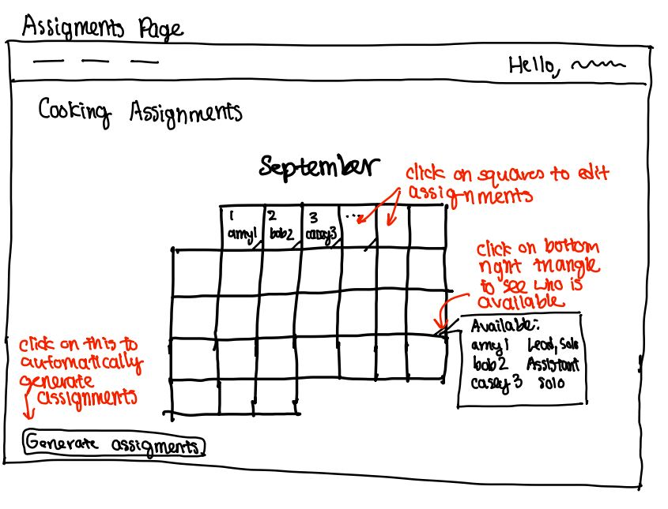

## Problem Statement

### Problem Domain

**WILG Meal Plan** The WILG meal plan provides 6 dinners a week, all cooked by house members, and snacks and breakfast items. Executing this meal plan involves 1) creating a cooking calendar each month based on member availability, assigning members as cooks for each cooking day; 2) collating dinner ingredients on a weekly basis; 3) collating snack and breakfast item requests on a weekly basis; 4) ordering all the groceries through various channels, including produce vendors, meat vendors and Instacart; 5) tracking food allergies and dietary restrictions. These tasks are managed by two members of WILG Exec, known as foodstuds. Currently dinners must be enough to feed 35 people, with various dietary restrictions accommodated. I am president of WILG and also regularly cook for the house, so I'm interested in making this process easier for cooks and WILG foodstuds in particular.

### Problem

**[WILG Meal Plan Cooking Assignments]** Everything outlined above is done manually and across various spreadsheets, forms and even random Slack threads (WILG communication occurs via Slack). In particular, member cooking availabilities and preferences are collected via a form and then one of the foodstuds manually assigns cooks based on the calendar. This often requires multiple revisions since people's availabilities can change.

### Stakeholder List

1. WILG Food Stewards: the two members of WILG Exec who are in charge of creating a cooking calendar, assigning cooks, and ordering groceries. Any automation of their task could make their task easier; a more customized UI (in comparison to Google Sheets) could also make their task easier and reduce the amount of time they spend on their role obligations. Learning a UI or software could also be a barrier though.

2. WILG Cooks: the residents of WILG who are assigned to cook on WILG's cooking calendar. A more customized UI could make it easier to enter availability and update that availability, as well as communicate with the food stewards. Learning a new UI could also be a barrier like above.

3. WILG Residents: individuals who are automatically on WILG's meal plan and eat dinners from the WILG calendar. Automation of the cooking schedule can reduce the chance that there's no one assigned to one day or that someone has to drop and so we have to eat leftovers.

### Evidence and Comparables

1. [Paprika](https://www.paprikaapp.com/). A meal-planning app that allows for ingredient collating, linking of recipes, and scheduling meals. Good for an individual, but not super compatible with WILG's cooking system, which involves specific distinctions between ingredients and also involves assigning different people to different days.

2. [Meal planning is associated with food variety, diet quality and body weight status in a large sample of French adults](https://pmc.ncbi.nlm.nih.gov/articles/PMC5288891/). This article discusses how meal planning, at least on an individual basis, improves health metrics for adults.

3. [Kooka Cooking Community](https://www.kookacommunity.com/). A meal-planning/recipe-planning website that allows for scheduling and ingredient collection. Has similar limitations to Paprika.

4. [Why Communal Living Can Make Us Happier](https://www.bbc.com/culture/article/20240429-why-living-with-strangers-can-make-us-happier). This article discusses how communal living systems that involve chore schedules and cooking plans or other modes of shared responsibility can help provide community and alleviate burdens.

5. My personal experience as a member of WILG and current president. As president, I often have to help the foodstuds trouble shoot problems, like rearranging the cooking calendar or getting missing ingredients. Assigning cooks is one of the first tasks in the pipeline of executing the WILG meal plan and all the other aspects of dinner follow after this. As a cook, sometimes I have to let the foodstuds that my availability wasn't accommodated, so the assignments need to be updated.

## Application Pitch

### Name

CookScheduler

### Motivation

CookScheduler automates the assignment of cooks to different days in a communal cooking calendar in accordance with cooks' self-reported availability and cooking preferences.

### Key Features

#### Preference Form

Cooks will be able to upload their cooking preferences (distinct from availability) in a form available on the site. This form will allow them to specify whether they are willing to cook on their own and/or cook with another person; if they are willing to be main cook if they cook with someone else; if there's anyone they want to cook with; how many times they want to cook in the month. The form will lock after a certain deadline, at which point it can't be edited.

#### Availability Form

This form will have a calendar UI with clickable squares that allows cooks to mark themselves as available to cook on that day. The form will default to no availability on any day. The form will lock after a cetain deadline, at which point it can't be edited.

#### Editable Cooking Calendar

This calendar will display cooking assignments in a calendar UI. This UI will also have clickable date squares that allows the foodstud to see who is available and their preferences on each day. After the form deadline, cooking assignments will be automatically generated and displayed on this calendar, but the foodstuds will be able to edit the schedule and change the assignments if they want. Cooks will be able to view the calendar but not edit it.

## Concept Design

### Concept Specifications

1. **concept** Form\[User\]

   **purpose** take in user input for a set of questions

   **principle** after users have filled out the form, the responses to the form can be used to guide decisionmaking

   **state**

   a set of Questions with

   &ensp; a string QuestionText

   &ensp; a set of Responses

   a set of Responses with

   &ensp; a User

   &ensp; a String or Boolean ResponseContent

   a Boolean Open

   **actions**

   submitResponse(user: User, question: Question, responseContent: String or Boolean)

   **requires** question exists in the set of Questions and Open is True

   **effects** creates a new Response with user and responseText and adds it to the set of Responses for question

   addQuestion(questionText: String)

   **requires** no Question with the same QuestionText exists in the set of Questions and Open is True

   **effects** creates a new question with questionText and an empty set of Responses and adds it to the set of Questions

   deleteQuestion(question: Question)

   **requires** question exists in the set of Questions and its set of Responses is empty and Open is True

   **effects** removes this question from Questions

   deleteResponse(user: User, question: Question)

   lockForm()

   **requires** Open is True

   **effects** sets Open to False

   openForm()

   **requires** Open is False and there is at least one question in Questions

   **effects** sets Open to True

2. **concept** PreferredRoles\[User\]

   **purpose** store cooking role preferences for scheduling

   **principle** after collecting user preferences, cooking assignments can be made that only assign people one of their preferred roles each day they cook

   **state**

   a set of Users with

   &ensp; a boolean CanSolo

   &ensp; a boolean CanLead

   &ensp; a boolean CanAssist

   &ensp; an int MaxCookingDays

   **actions**

   upload(user: User)

   **requires** user is not the set of Users

   **effects** adds User to the set with canSolo, canLead, canAssist defaulting to False and maxCookingDays defaulting to 0

   update(user: User, canSolo: boolean)

   **requires** user is in the set of Users

   **effects** updates user's CanSolo boolean to canSolo

   update(user: User, canLead: boolean)

   **requires** user is in the set of Users

   **effects** updates user's CanLead boolean to canLead

   update(user: User, canAssist: boolean)

   **requires** user is in the set of Users

   **effects** updates user's CanAssist boolean to canAssist

   updateMaxCookingDays(user: User, maxCookingDays: int)

   **requires** user is in the set of Users, maxCookingDays is nonnegative

   **effects** updates user's MaxCookingDays to maxCookingDays

3. **concept** UserAvailabilities\[User, Month, Date\]

   **purpose** store User cooking availability for scheduling

   **principle** after collecting user availability, cooking assignments can be created that only assigns cooks to days they are available

   **state**

   a Month

   a set of Users with

   &ensp; a set of dates AvailableDates

   **actions**

   upload(user: User)

   **requires** user is not in the set of Users

   **effects** adds this user to the set of Users and sets its AvailableDates to an empty set

   addAvailability(user: User, date: Date)

   **requires** user is in the set of Users and date is not in user's AvailableDates

   **effects** adds date to user's AvailableDates

   removeAvailability(user: User, date: Date)

   **requires** user is in the set of Users and date is in user's AvailableDates

   **effects** removes date from user's AvailableDates

4. **concept** CookingAssignments\[UserAvailabilities, UserPreferences, User\]

   **purpose** track cooking assignments for the month so we know who cooks when

   **principle** after user availabilities and user preferences are uploaded, can automatically generate a set of cooking assignments, which can then be edited by foodstuds

   **state**

   a Month

   a set of dates CookingDates

   a set of Users

   a UserAvailabilities Availabilities

   a PreferredRoles Preferences

   a set of Assignments with

   &ensp; a date CookingDate

   &ensp; a Lead

   &ensp; an Assistant (optional)

   **actions**

   addCookingDate(date: Date):

   **requires** date is not in CookingDates and date is in Month

   **effects** adds date to CookingDates

   assignLead(user: User, date: Date)

   **requires** date is in CookingDates; user is in the set of Users

   **effects** creates a new Assignment with date and Lead set to user if there is no existing Assignment for this date, or updates an existing Assignment if there already is an Assignment for this date

   assignAssistant(user: User, date: Date)

   **requires** date is in CookingDates; user is in the set of Users; there is already an Assignment with this date in the set of Assignments

   **effects** sets Assistant in the existing Assignment for this date to be user

   removeAssignment(date: Date)

   **requires** there is an Assignment with this date in the set of Assignments

   **effects** removes this Assignment from the set of Assignments

   upload(preferredRoles: PreferredRoles)

   **requires** all Users in preferredRoles are in the set of Users

   **effects** sets Preferences to preferredRoles

   upload(userAvailabilities: UserAvailabilities)

   **requires** all Users in userAvailabilities are in the set of Users

   **effects** sets Availabilities to userAvailabilities

   generateAssignments()

   **requires** user is in the set of Users for both Availabilities and Preferences

   **effects** generates an assignment of Users to the CookingDates that violates no constraints in Availabilities or Preferences

   validate(): boolean

   **requires** no constraints in Preferences or Availabilities are violated across the Assignments

   **effects** returns True

### Synchronizations

1. **sync** validate

   **when**

   CookingAssignments.assignLead(user, date)

   **then**

   CookingAssignments.validate()

2. **sync** upload

   **when**

   PreferredRoles.update(user, canSolo)

   **then**

   CookingAssignments.upload(preferredRoles)

3. **sync** update

   **when**

   Form.submitResponse(user, question, responseContent)

   **where** question is asking about whether they can solo, and responseContent is a Boolean

   **then**

   PreferredRoles.update(user, canSolo: responseContent)

### Brief Note

The Form concept covers how info from users will be collected and stored. There are two types of information we are interested in from users, which are encapsulated in the PreferredRoles and UserAvailability concepts. Finally, the CookingAssignment concept stores the info this product is made for, which is the assignment of members to different cooking days in accordance with preferences and availability.

## UI Sketches

## User Journey

User A is a member of WILG and plans to cook for the house in September. They are busy this month, so they only want to cook once. They have classes Monday through Friday, so they are only able to cook on Sundays. (WILG doesn't have dinner on Saturdays.) They have strong opinions about what to cook, and don't like cooking with other people, so they are only willing to cook on their own.

In mid August, they enter CookScheduler by entering their kerb into the entry page. The first page they see is the cooking assignments page, which has no one assigned to any day since assignments have not been generated yet.

User A knows they need to enter their preferences and availability. They navigate to the Preferences page by using the top navbar. In this page, they enter that they can only cook solo, and that they cannot be lead or assistant cook, and that they want to cook at most once.

User A then navigates via the same navbar to the Availability page, where they mark all Saturdays as available. This is all the information required for them, so they close the tab for CookScheduler.

In late August, the foodstuds announce that the cooking calendar has been finalized. User A goes back into the site to see that they have been assigned to the third Sunday in September as a solo cook. They start brainstorming ideas and finding recipes.
